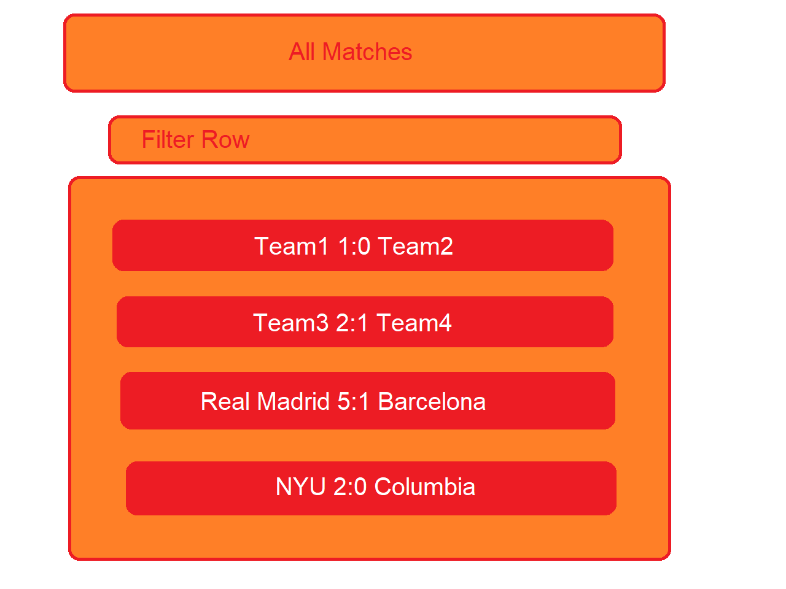
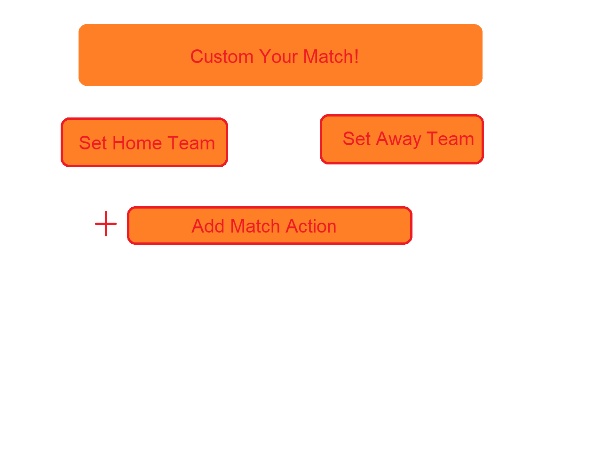
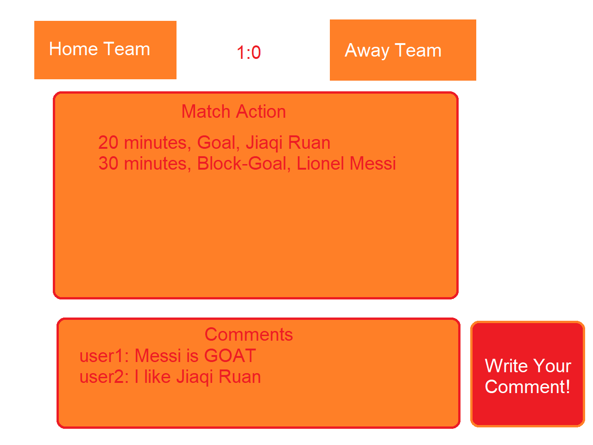
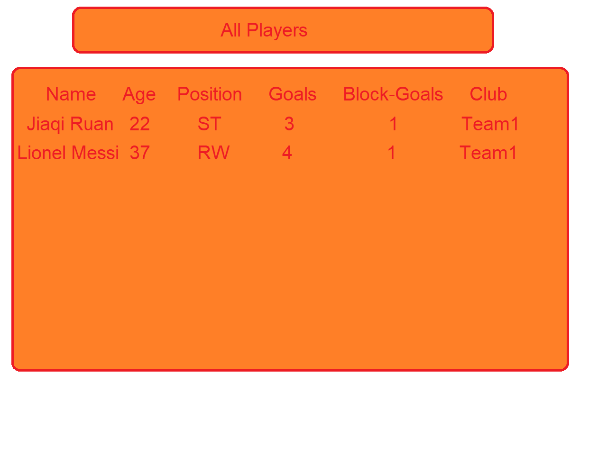
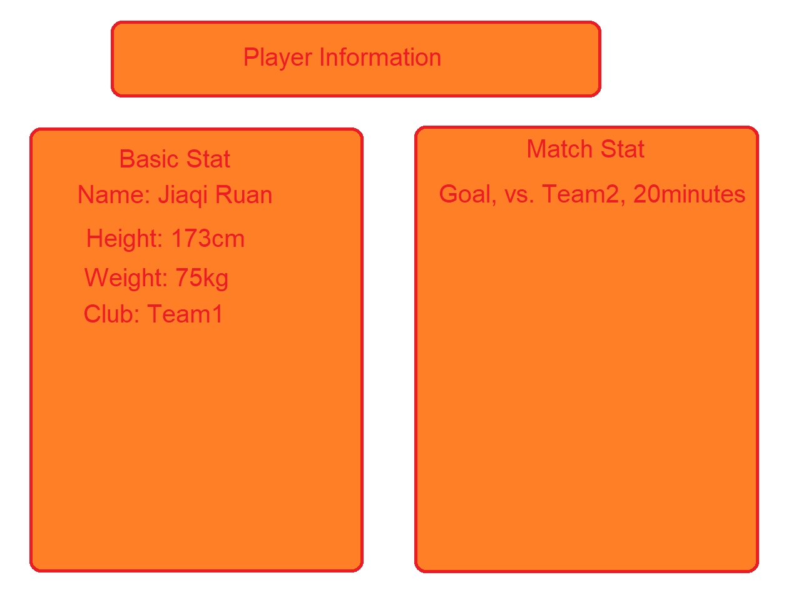
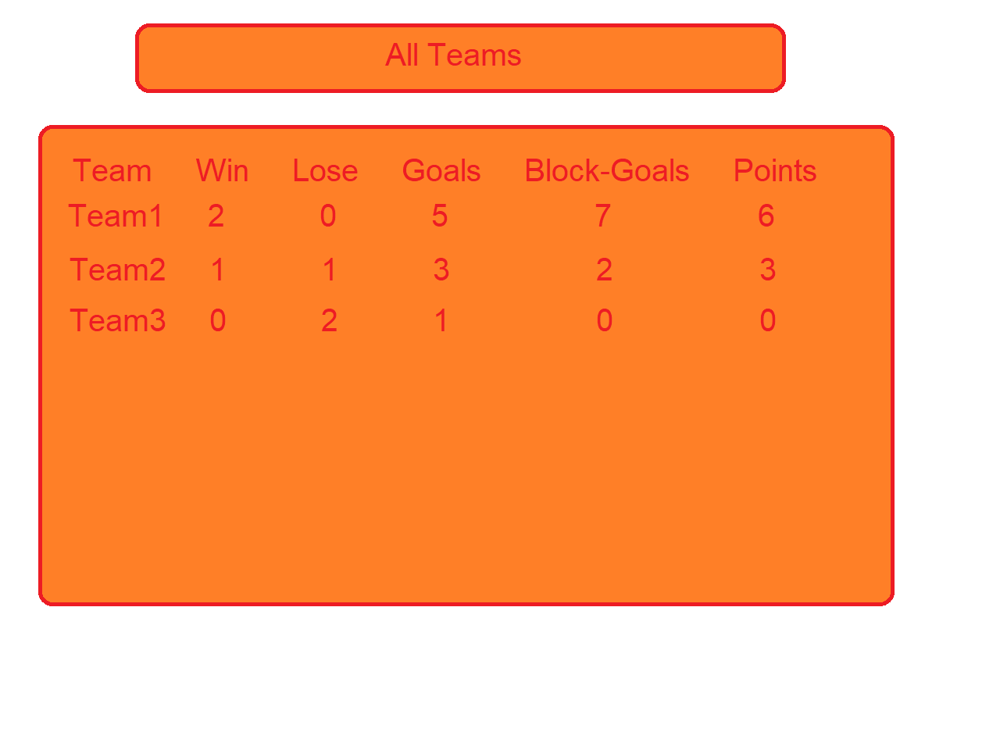
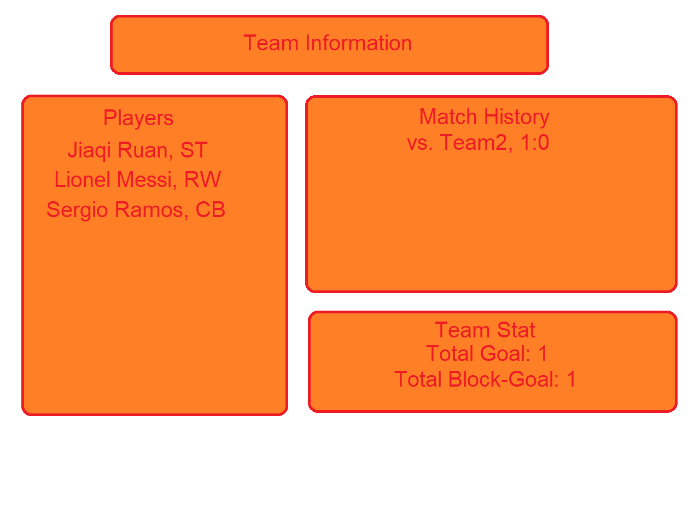

(__TODO__: A Simple Soccer Forum)

# Jiaqi Ruan

## Overview

Everyone loves soccer! But instead of watching a soccer game, why not create and manipulate a soccer game yourself? Imagine suddenly you have the magical power of deciding every soccer game and it can goes whatever you want, that would be funny, isn't it? After you create a match, it will be published in the website and other user can comment on it!

The cooooooolest thing about it is that all of these crazy games will be recorded! Just like a real life soccer forum, you can view all the stats of these crazy games created by magcial people like you in the website. And of course, player performance (goals, assists) will also be recorded and you can also view them in the website. In conclusion, it basically does all the things that a normal soccer forum does (displaying stats about matches, players and teams), but the source of the stat comes from user's creation rather than reality. 

## Data Model

The application will store Users, Matches, Comments, MatchActions, Teams, and Players

* Each User can have multiple matches they created (via reference for now) and comment they posted (also via refernce for now)
* Each Match can have two teams, home and away, (via embedded). And a list of MatchAction (via embedded). It should also have a list of comment from users, and of course, the user who create the match
* Each Comment will have a user (whoever post it), and a match(via reference)
* Each MatchAction will have a type(goal, assist, block-goal), a match that this action happened in (via reference), a time that the action happen (90 minutes of the match), and which player this MatchAction belong to.
* Each Teams will have a list of Players (via reference), and a team stat for all MatchActions.
* Each Players will have a team they play for (via reference), and they personal stats of their own MatchAction, and of course basic information. 

An Example User:

```javascript
{
  username: "jiaqiruan",
  hash: // a password hash,
  matches: // an array of references to Match documents,
  comments: //an array of references to Comment documents,
}
```

An Example Match:

```javascript
{
  hometeam: //hometeam name,
  awayteam: //awayteam name,
  matchActions: //an array of references to MatchAction documents,
  user: //reference to User documents,
}
```
An Example Comment:

```javascript
{
  match: //reference to Match documents,
  user: //reference to User documents,
}
```
An Example MatchAction:

```javascript
{
  type: "goal",
  match: //a reference to a Match document
  time: 90,
  player://a reference to a Player document
}
```

An Example Team:

```javascript
{
  name: "Real Madirid",
  players: //a array of reference to Player documents,
  totalGoals: 100,
  totalAssists: 100,
  totalBlockGoals: 100,
}
```
An Example Player:

```javascript
{
  name: "Christinao Ronaldo",
  team: //a reference to Team documents,
  birthday://a date type data
  height: 189,
  weight: 180,
  matchActions://an array of reference to matchAction documents
}
```


## [Link to Commented First Draft Schema](db.mjs) 


## Wireframes

(__TODO__: wireframes for all of the pages on your site; they can be as simple as photos of drawings or you can use a tool like Balsamiq, Omnigraffle, etc.)

/match - page for showing all matches


/match/create - page for creating a new match



/match/view - page for viewing a match



/player - page for showing all players


/player/view - page for showing player information



/team - page for showing all teams


/team/view - page for showing team information



## Site map

[sitemap](documentation/sitemap.png)
## User Stories or Use Cases

1. as non-registered user, I can register a new account with the site
2. as a user, I can log in to the site
3. as a user, I can create a new match-up and post it
4. as a user, I can add matchAction to a match
5. as a user, I can post comments on existing matches
6. as a user, I can view stats of teams and players

## Research Topics

* (5 points) CSS modules
    * I want to learn and pratice using css modules so I think it will be a good fit if I add it to my project
    * using Sass
* (4 points) Perform client side form validation using a JavaScript library
    * if the match score is impossible, (100:200), an error message will appear in the dom
    * 
* (5 points) React
    * used React as the frontend framework; it's a challenging library to learn, so I've assigned it 5 points

10 points total out of 8 required points (___TODO__: addtional points will __not__ count for extra credit)


## [Link to Initial Main Project File](app.mjs) 

(__TODO__: create a skeleton Express application with a package.json, app.mjs, views folder, etc. ... and link to your initial app.mjs)

## Annotations / References Used

(__TODO__: list any tutorials/references/etc. that you've based your code off of)

