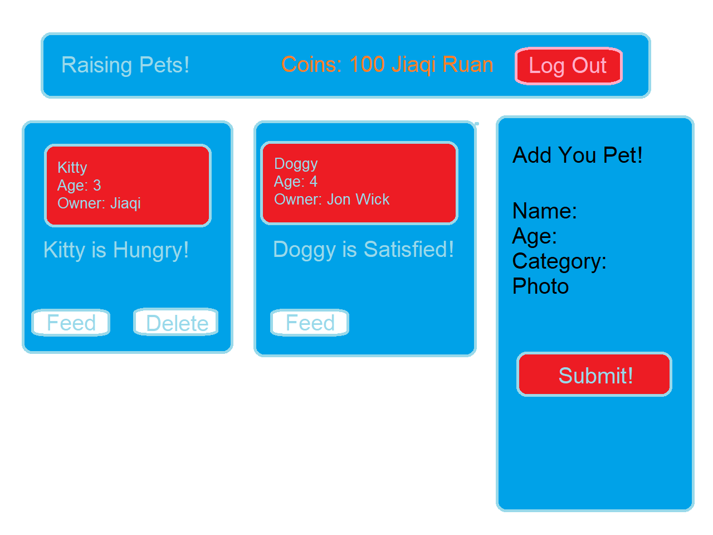
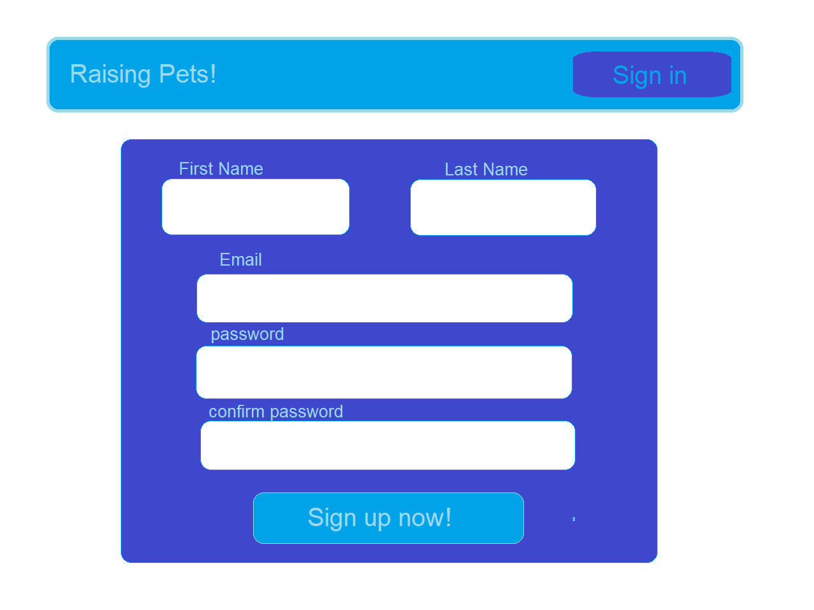

(__TODO__: A Digital Pets Forum)

# Jiaqi Ruan

## Overview

Everyone loves pets! But instead of having a real pet which you have to worry about all the messy stuff related to taking care of a pet, why not just have a digital, virtual pet? In this website, you can choose your own digital pet and enjoy the company of pets without doing actual petkeeping work! 

No only can you choose pets from pre-set base, you can also create your own pet by uploading photos and customize everything about the pet! After you create or choose a pet, you can interact with it by many ways. The pet will be "Hungry" overtime so you need to feed them. The pet will get "Bored" so you need to play with them. Also, you can check other's pet and interact with them too! 

## Data Model

The application will store Users, Pets

* Each User can have one or more pets. Each user will have coins that they can use to increase the hunger stat of the Pet. 
* Each Pet have its basic stats (name, species, photos, age...) and also virtual pet stats. A hunger stat representing how hungry the pet is, and a mood stat representing the mood of the pet. And of course, the owner who owns them.

An Example User:

```javascript
{
  username: "jiaqiruan",
  password: // a password hash,
  coins: 20 //number of coins that the user process
  email: "123@nyu.edu"
}
```

An Example Pet:

```javascript
{
  name: "kitty",//name of the pet
  age:3,
  category:"cat",
  photo: "",
  hunger: 80,//hunger stat, maximum 100
  mood: 60,//mood stat, maximum 100
  owner://String
}
```


## [Link to Commented First Draft Schema](db.mjs) 


## Wireframes

(__TODO__: wireframes for all of the pages on your site; they can be as simple as photos of drawings or you can use a tool like Balsamiq, Omnigraffle, etc.)

/home - page for all interaction


/auth - page authentication



## Site map


## User Stories or Use Cases

1. as non-registered user, I can register a new account with the site
2. as non-registered user, I can viwe other's pets
3. as a user, I can log in to the site
4. as a user, I can create a new pet 
5. as a user, I can delete and edit my pets
6. as a user, I can feed my pets and other's pets

## Research Topics

* (4 points) ui-material
    * using ui-material core to create simply ui layout
* (5 points) Redux
    * Redux is a great tool for managin states, (in my case the user's coins, the pets' hunger and mood stats), so I decided to learn it and use it
* (5 points) React
    * used React as the frontend framework; it's a challenging library to learn, so I've assigned it 5 points

10 points total out of 8 required points (___TODO__: addtional points will __not__ count for extra credit)


## [Link to Initial Main Project File](app.mjs) 

(__TODO__: create a skeleton Express application with a package.json, app.mjs, views folder, etc. ... and link to your initial app.mjs)

## Annotations / References Used

https://www.youtube.com/watch?v=aibtHnbeuio&t=124s
https://github.com/adrianhajdin/project_mern_memories/tree/PART_1_and_2

## Milestone 3

progress: Using React, Redux and material-ui to create a fully interactive website of upload pets, deleting pets and feeding pets. Please see the client folder for all the code for the front-end React and Redux FrameWork.